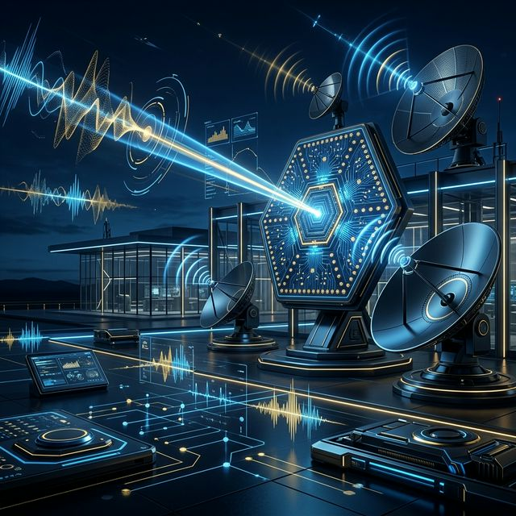

# Anten Mühendisliği: Post-AI Dönemi Yazılı Eseri 📡🤖⚡

> **"Klasik elektromanyetizmanın disiplini, yapay zekanın hızı ve öngörüsüyle birleştiğinde yeni nesil mühendislik başlar."**

Bu depo; geleneksel elektromanyetik teori, anten tasarımı ve bu teknolojilerin **Elektronik Harp (Electronic Warfare - EW)** sahasındaki stratejik kullanımını, **Post-AI (Yapay Zeka Sonrası)** mühendislik perspektifiyle ele alan interaktif bir teknik kitaptır. Mevcut literatürdeki statik modellerin ve geleneksel analitik çözümlerin ötesine geçerek; büyük verinin (Big Data), derin öğrenme algoritmalarının ve otonom sistemlerin klasik elektromanyetizma ile nasıl bir simyaya dönüştüğünü (Data-Driven Electromagnetics) en ince detayına kadar inceler. Bu eser, mühendislere sadece "nasıl" tasarlayacaklarını değil, yapay zekayı bir EM çözücü (solver) gibi nasıl kullanacaklarını öğretmeyi amaçlar.

### 🚀 [Eğitim Yol Haritası: 8 Seviyeli Uzmanlık](Roadmap.md)
*Temel fiziksel temellerden başlayarak, yapay zeka tabanlı otonom anten tasarımına (Level 08) kadar uzanan; her seviyenin sonunda bir "Capstone Project" içeren, akademik titizlikle hazırlanmış 8 aşamalı kapsamlı müfredat. Bu yol haritası, bir mühendisin klasik teoriyi öğrenip AI ile nasıl "insanüstü" tasarımlar yapabileceğini kademeli olarak gösterir.*

---

## 🏗️ Post-AI Dizayn Metodolojisi

Geleneksel anten tasarım döngüsü (Analiz-Modifikasyon-Tekrar Analiz), Post-AI döneminde yerini verimli bir **"Otonom Sentez"** döngüsüne bırakmıştır. Bu proje, şu 4 adımlı metodolojiyi savunur:

1.  **Gereksinim Tanımlama:** Kazanç, bant genişliği ve SLL (Yan Lob Seviyesi) kriterlerinin "Maliyet Fonksiyonu" (Cost Function) olarak matematiksel formülasyonu.
2.  **Surrogate (Vekil) Model Eğitimi:** Tam dalga (Full-wave) simülasyonlardan alınan küçük bir veri setiyle, EM davranışını taklit eden bir Deep Neural Network eğitilmesi.
3.  **Otonom Optimizasyon:** Genetik Algoritmalar veya Takviyeli Öğrenme (RL) ajanlarının, vekil model üzerinde saniyeler içinde milyonlarca iterasyon yaparak global optimum geometiyi bulması.
4.  **Kritik Doğrulama:** Bulunan optimum tasarımın CST/HFSS gibi altın standart çözücülerde son bir kez doğrulanması ve üretim dosyalarının (GDSII/Gerber) oluşturulması.

---

## ⚡ Anten Nedir ve Nasıl Çalışır? (Öz Şamil)

En profesyonel ve akademik tanımıyla **anten**, bir devredeki iletilen elektrik akımını (kılavuzlanmış dalga - guided wave), boşlukta yayılan elektromanyetik dalgaya (serbest uzay dalgası - free space wave) dönüştüren veya alıcı modunda bu enerjiyi tekrar devreye hapseden bir **geçiş yapısı (transducer)**'dır. Bu dönüşüm, devreden gelen yüksek frekanslı AC sinyalinin, dielektrik veya metalik yapılar aracılığıyla boşluğun karakteristik empedansına ($377 \Omega$) uyumlandırılması ve enerjinin "radyasyon" (ışıma) olarak serbest bırakılması sürecidir. Anten, aslında bir empedans dönüştürücü ve dalga kılavuzu sonlandırıcısıdır.

### 🧠 Temel Mekanizma ve Fiziksel İlkeler
1.  **Akımdan Dalga Oluşumu (Maxwell-Ampere & Faraday Yasası):** Bir iletken üzerindeki serbest yükler ivmelendiğinde (zamanla değişen AC akım), Maxwell denklemlerine göre birbirini tetikleyen bir zincirleme reaksiyon başlar: Değişen elektrik alanı ($\mathbf{E}$) bir manyetik alan ($\mathbf{H}$) doğurur, o da tekrar bir elektrik alanı oluşturur. Bu karşılıklı etkileşim, kaynaktan bağımsız bir şekilde uzay-zamanda yayılan "elektromanyetik dalga"yı meydana getirir.
2.  **Karşılıklılık İlkesi (Lorentz Reciprocity Theorem):** Bir antenin verici (TX) olarak sahip olduğu tüm teknik karakteristikler —kazanç diyagramı, ana hüzme genişliği, giriş empedansı ve polarizasyon durumu— alıcı (RX) olarak çalıştığında da matematiksel olarak aynen korunur. Bu ilke, doğrusal (linear), pasif ve izotropik olmayan (non-isotropic) ortamlar için mühendislik tasarımını büyük ölçüde basitleştirir. 
3.  **Empedans Uyumu ve VSWR (Maximum Power Transfer):** Enerjinin antenden atmosfere kayıpsız fırlatılabilmesi için iletim hattının karakteristik empedansı (standart $50 \Omega$ veya $75 \Omega$) ile antenin giriş empedansının ($\mathbf{Z}_{in} = R + jX$) kompleks eşlenik (complex conjugate) uyumu içinde olması gerekir. Uyumsuzluk durumunda enerji antene ulaşmadan geri yansıyarak Duran Dalga Oranı (VSWR) yükseltir, bu da hem güç kaybına hem de yüksek güçlü EH sistemlerinde donanımın ısınarak zarar görmesine neden olur.

### 🛡️ Elektronik Harp'te Antenin Rolü
Elektronik Harp (EH) sahasında anten, yalnızca bir haberleşme ucu veya veri aktarıcı değil; elektromanyetik spektrumun kontrolünü, manipülasyonunu ve domine edilmesini sağlayan bir **stratejik silahtır**:
- **Göz (ES - ELINT/SIGINT):** Düşman radarlarının ve haberleşme sistemlerinin yaydığı sinyalleri "spektral olarak koklayarak" kaynakların konumunu (Angle of Arrival - AoA), teknik parametrelerini (PRI, PW, Modülasyon tipi) ve operasyonel amacını milisaniyeler içinde teşhis eder. AI destekli sinyal sınıflandırıcılar, bu antenlerden gelen ham veriyi işleyerek "parmak izi" analizi yapar.
- **Kalkan (EP - Electronic Protection):** Dost birliklerin haberleşme linklerini ve sensörlerini; düşük yan lob seviyeleri (Low Sidelobe), gelişmiş polarizasyon filtreleme ve düşük tespit edilebilirlik (LPI/LPD) özellikli konformal anten tasarımları ile düşman karıştırmasından ve tespiti nden izole eder.
- **Kılıç (EA - Jamming/Electronic Attack):** Elektromanyetik enerjiyi AI tarafından belirlenen dar bir hüzmeye (beam) hapsederek veya spektral olarak geniş bir alana yayarak (Barrage Jamming) düşman alıcılarını geçici (soft-kill) veya kalıcı (hard-kill) olarak kör eder, sahte hedeflerle (Deception) sistemlerini yanıltır.

---

## 🏛️ Mimari Yapı ve Müfredat

Proje, bir Elektronik Harp sisteminin yaşam döngüsüne ve anten mühendisliğinin temel direklerine uygun olarak 4 ana modüle ayrılmıştır:

### 1. 📖 [Elektromanyetik Teori ve Işıma Esasları](Theory/)
Antenin fiziksel katmanını, sınır şartlarını (Boundary Conditions) ve dalganın boşluktaki propagasyon (yayılım) davranışını matematiksel olarak modellemek, modern bir EH stratejisinin en temel gerekliliğidir.
- **Maxwell Denklemleri:** Kaynaktan uzaklaşan dalgaların uzay-zaman sürekliliği üzerindeki değişimini (Divergence, Curl) açıklayan evrensel matematiksel anahtar.
- **Işıma Mekanizması:** Akım yoğunluğu ($J$) ve yük ivmelenmesinin, yardımcı vektör potansiyelleri ($A$ ve $F$) üzerinden ışıma integrallerine dönüşüm süreci ve Green fonksiyonları ile analizi.
- **Yakın Alan (Reactive/Radiating) vs Uzak Alan (Fraunhofer):** Faz ve genlik dağılımının stabilize olduğu, ölçüm hassasiyetini ve taktik analiz (RCS, Gain) sınırlarını belirleyen kritik bölgelerin (Rayleigh mesafe kriteri gibi) tanımlanması.
- **Friis İletim Denklemi & Link Bütçesi:** Sinyal gücünün atmosferik kayıplar, serbest uzay yayılım kaybı ($L_{FS}$), polarizasyon mismatch ve anten kazançları eşliğinde uçtan uca yönetimi ve sistem gürültüsü ($G/T$) ile entegrasyonu.

### 2. 🎯 [Kritik Anten Parametreleri (EH Perspektifi)](Parameters/)
Bir EH operasyonunun başarısı, kullanılan antenin ticari ve standart haberleşme antenlerinden çok daha sert, dinamik ve geniş kapsamlı performans kriterlerine sahip olmasına bağlıdır:
- **Ultra Geniş Bantlılık (Ultra-UWB):** Tek bir anten mekanik yapısıyla 0.5 GHz'den 18 GHz'e (hatta 40 GHz'e) kadar tüm tehdit spektrumunu, empedans uyumunu bozmadan ve patern kararlılığını koruyarak kesintisiz kapsayabilme yeteneği.
- **Sidelobe Kontrolü & LPI (Low Sidelobe):** Düşman ES sistemleri tarafından tespit edilme riskini minimize etmek için yan lobların (Sidelobes) ana hüzmeye (Main Beam) göre en az -20 dB veya daha aşağı seviyelerde baskılanması.
- **Polarizasyon Çevikliği & Adaptasyon (Agility):** Değişen düşman sinyal polarizasyonlarına (Yatay, Dikey, Dairesel) saniyeler içinde uyum sağlayabilme veya çapraz polarizasyon (Polarization Mismatch) tekniği ile jamming etkinliğini maksimize etme.
- **Güç Yönetimi & Termal Kararlılık (High Power Handling):** Kilowatt seviyesindeki yüksek güçlü karşı tedbir sinyallerini (Electronic Attack), dielektrik patlaması veya VSWR kaynaklı donanım hasarı almadan uzaya verimli fırlatabilme kapasitesi.

### 3. 🚀 [Stratejik Anten Türleri ve Uygulamalar](Applications/)
Elektronik Harp taktik sahasında fark yaratan, spektral üstünlüğü belirleyen ve modern muharip platformları domine eden kritik anten mimarileri:
- **Yön Bulma (DF) Antenleri:** Geniş bantlı spiral, log-periodic ve özellikle yüksek faz hassasiyetli interferometrik dizi (Interferometric Arrays) yapılarıyla düşman yayınlarının coğrafi koordinatlarını (AoA/DoA) büyük bir doğrulukla kestirme.
- **Active Electronically Scanned Array (AESA):** Mekanik hareket gerektirmeden, binlerce anten elemanının fazını anlık kaydırarak hüzmeyi milisaniyeler içinde yönlendirme; bu sayede aynı anda takip, tarama ve saldırı kabiliyeti.
- **Digital Beamforming (DBF):** RF sinyalini doğrudan dijital domainde işleyerek aynı anda onlarca farklı yöne bağımsız hüzme oluşturabilme ve düşman karıştırmasını "adaptive null-steering" algoritmaları ile dinamik olarak yok etme.
- **Yüksek Kazançlı Horn ve Reflektör Antenler:** Ultra dar hüzme genişliği ve yüksek kazanç (High Gain) gerektiren noktadan noktaya jamming, uydu haberleşmesi ve uzak mesafe radar kesit alanı (RCS) gözlemleme operasyonları.

### 4. 💻 [Simülasyon, Analiz ve SDR](Simulation/)
Modern anten mühendisliği ve EH stratejileri, artık klasik hesaplamaların çok ötesinde, muazzam bir hesaplama gücü, simülasyon derinliği ve yapay zeka entegrasyonu gerektirir:
- **Sayısal Elektromanyetik Çözücüler (Solvers):** CST Studio Suite (FIT/TLM), HFSS (FEM) ve FEKO (MoM/MLFMA) gibi platformlar üzerinden Maxwell denklemlerinin karmaşık geometriler için sayısal çözümü.
- **Hesaplamalı EH (Computational EW):** MATLAB, Python ve C++ kütüphaneleri kullanarak Radar Kesit Alanı (RCS) tahmini, karıştırma-sinyal oranı ($J/S$) analizleri.
- **Post-AI Simülasyon Hızlandırma:** Derin sinir ağları ve vekil modelleme yöntemleri ile, geleneksel yöntemlerle saatler süren simülasyon süreçlerini milisaniyeler seviyesine indirgeme.

---

## 🛠️ İnteraktif Mühendislik Araçları (Scripts)

Proje, dökümantasyonun ötesinde, doğrudan terminal üzerinden çalıştırılabilen profesyonel araçlar sunar:

- **[AI Optimizer Template](Scripts/AI_Optimizer_Template.py):** Belirlenen anten parametrelerini optimize etmek için Genetic Algorithm tabanlı bir başlangıç şablonu.
- **[Beamforming Visualizer](Scripts/Beamforming_Visualizer.py):** Phased array antenlerin hüzmeleme (beamforming) ve tarama (scanning) paternlerini anlık görselleştiren interaktif araç.
- **[Link Budget Calculator](Scripts/Link_Budget_Calculator.py):** Friis denklemi bazlı, yol kaybı ve gürültü tabanı hesaplayan profesyonel link analiz aracı.
- **[Surrogate Dataset Generator](Scripts/Surrogate_Dataset_Generator.py):** AI modellerini eğitmek için sentetik EM verisi üreten simülasyon köprüsü.

---

## 📐 Matematiksel Temeller ve Hızlı Referans

| Kavram | Formülasyon / İlke | EH Karşılığı |
| :--- | :--- | :--- |
| **Maxwell-Ampere** | $\nabla \times \mathbf{H} = \mathbf{J} + \epsilon \frac{\partial \mathbf{E}}{\partial t}$ | Sinyal Yayılımı |
| **Friis Denklemi** | $P_r = P_t G_t G_r (\frac{\lambda}{4\pi R})^2$ | Jamming Etki Mesafesi |
| **Radar Denklemi** | $P_r = \frac{P_t G^2 \lambda^2 \sigma}{(4\pi)^3 R^4}$ | Tespit Menzili |
| **Dizi Faktörü** | $AF = \sum e^{j(nkd\cos\theta + \beta)}$ | Hüzme Yönlendirme |

---

## 📜 Lisans ve Katkı
Bu proje **MIT Lisansı** ile korunmaktadır. Akademik veya profesyonel katkı sağlamak isteyen araştırmacılar [CONTRIBUTING.md](CONTRIBUTING.md) dosyasını inceleyebilirler.

---

## 🛠️ Elektronik Harp Operasyonel Kabiliyetleri

Repo içerisinde, bir modern Elektronik Harp sisteminin kalbini ve işletim sistemini oluşturan şu üç ana fonksiyonel alan için ileri seviye akademik teorik notlar, matematiksel modeller ve doğrulanmış Python algoritmaları yer almaktadır:

1.  **ES (Elektronik Destek - Electronic Support):** Tehdit tespit ve analizinin ilk hattıdır. Gelen sinyallerin Varış Açısı (AoA) kestirimi için MUSIC, ESPRIT ve Root-MUSIC gibi alt uzay tabanlı (Subspace-based) yüksek çözünürlüklü algoritmaların pratik implementasyonları.
2.  **EA (Elektronik Taarruz - Electronic Attack):** Spektral enerjinin bir karşı önlem silahı olarak manipülasyonu. Akıllı gürültü karıştırması (Smart Noise), DRFM tabanlı dijital bellekli aldatma (Range/Velocity Gate Pull-Off) ve otonom jamming karar destek mekanizmaları.
3.  **EP (Elektronik Koruma - Electronic Protection):** Defansif elektromanyetik dayanıklılık. Frekans atlatma (FHSS), düşük yan loblu patern sentezi, gelişmiş boşluk oluşturma (Null-steering) ve yapay zeka destekli otonom sinyal izlemeye karşı koruma protokolleri.

---

## 📜 Lisans ve Katkı
Bu proje **MIT Lisansı** ile korunmaktadır. Akademik veya profesyonel katkı sağlamak isteyen araştırmacılar [CONTRIBUTING.md](CONTRIBUTING.md) dosyasını inceleyebilirler.

---
**Yazar:** [Bahattin Yunus Çetin](https://github.com/arch-yunus)  
*IT Architect & RF Systems Researcher*
